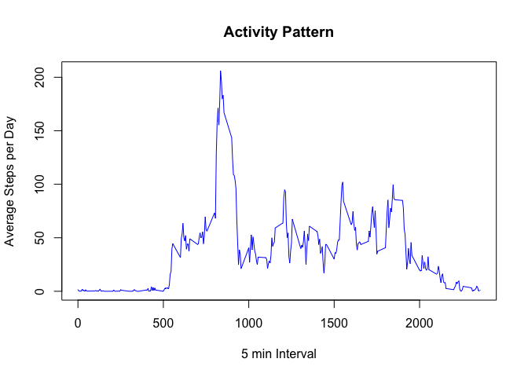

# Reproducible Research: Peer Assessment 1

Assessment 1 - Introduction
----------------------------

It is now possible to collect a large amount of data about personal movement using activity monitoring devices such as a Fitbit, Nike Fuelband, or Jawbone Up. These type of devices are part of the "quantified self" movement - a group of enthusiasts who take measurements about themselves regularly to improve their health, to find patterns in their behavior, or because they are tech geeks. But these data remain under-utilized both because the raw data are hard to obtain and there is a lack of statistical methods and software for processing and interpreting the data.

This assignment makes use of data from a personal activity monitoring device. This device collects data at 5 minute intervals through out the day. The data consists of two months of data from an anonymous individual collected during the months of October and November, 2012 and include the number of steps taken in 5 minute intervals each day.


## Loading and preprocessing the data

```r
activity <- read.csv("./data/activity.csv", header = TRUE)
```

## What is mean total number of steps taken per day?

*Calculate the total number of steps taken per day*

```r
stepsPerDay <- aggregate(steps ~ date, data = activity, sum, na.rm=TRUE)
```
*Make a histogram of the total number of steps taken each day*

```r
hist(stepsPerDay$steps, main="Total number of steps per day", 
                        xlab="Number of steps", 
                        ylab= "Frequency in minutes", 
                        plot=TRUE)
```

 

*Calculate and report the mean and median of the total number of steps taken per day*

```r
mean(stepsPerDay$steps)
```

```
## [1] 10766.19
```

```r
median(stepsPerDay$steps)
```

```
## [1] 10765
```

## What is the average daily activity pattern?

*Make a time series plot (i.e. type = "l") of the 5-minute interval (x-axis) and the average number of steps taken, averaged across all days (y-axis)*

```r
stepsInterval <- aggregate(steps ~ interval, data = activity, mean, na.rm=TRUE)
with(stepsInterval, plot(interval, steps,type="l", 
                                        ylab= "Average Steps per Day", 
                                        xlab="5 min Interval", 
                                        col="blue"))
title(main="Activity Pattern")
```

 

*Which 5-minute interval, on average across all the days in the dataset, contains the maximum number of steps?*

```r
stepsInterval[which.max(stepsInterval$steps), ]$interval
```

```
## [1] 835
```

## Imputing missing values

*Calculate and report the total number of missing values in the dataset (i.e. the total number of rows with NAs)*

```r
sum(is.na(activity$steps))
```

```
## [1] 2304
```
*Devise a strategy for filling in all of the missing values in the dataset.*

**As a result of calculating the average of the daily activity data they are assigned to the NA values.**

*Create a new dataset that is equal to the original dataset but with the missing data filled in.*

```r
# Make a new dataset with the original data
activityFilled <- activity
count = 0 
for (i in 1:nrow(activityFilled))
{
        # Check for NA values
        if (is.na(activityFilled[i, ]$steps))
        {
                # Assign the value for the corresponding interval at each step
                activityFilled[i, ]$steps <- 
                        stepsInterval[stepsInterval$interval== 
                                           activityFilled[i, ]$interval, ]$steps
                count = count + 1
        }
}
cat("Total of NA values were filled:", count, ".\n\r")
```

```
## Total of NA values were filled: 2304 .
## 
```
*Make a histogram of the total number of steps taken each day and Calculate and report the mean and median total number of steps taken per day.*

```r
stepsPerDay2 <- aggregate(steps ~ date, data = activityFilled, sum, na.rm=TRUE)
hist(stepsPerDay2$steps, main="Total number of steps per day", 
                         xlab="Number of steps", 
                         ylab= "Frequency in minutes", 
                         plot=TRUE)
```

 

*Calculate the mean and median*

```r
mean(stepsPerDay2$steps)
```

```
## [1] 10766.19
```

```r
median(stepsPerDay2$steps)
```

```
## [1] 10766.19
```
*Do these values differ from the estimates from the first part of the assignment? What is the impact of imputing missing data on the estimates of the total daily number of steps?*

**The mean value is the same as the value before imputing the missing values. The median shows a minor difference.**


## Are there differences in activity patterns between weekdays and weekends?
*Create a new factor variable in the dataset with two levels - "weekday" and "weekend" indicating whether a given date is a weekday or weekend day.*

```r
activityFilled$dayType <- ifelse(weekdays(as.Date(activityFilled$date,format="%Y-%m-%d")) %in% 
                        c("Satuday", "Sunday"),"weekend", "weekday")
```
*Make a panel plot containing a time series plot (i.e. type = "l") of the 5-minute interval (x-axis) and the average number of steps taken, averaged across all weekday days or weekend days (y-axis).*

```r
library(lattice)
activityWeekday = aggregate(steps ~ interval + dayType, activityFilled, mean)
xyplot(steps ~ interval | factor(dayType), data = activityWeekday, aspect = 1/2, 
       type = "l")
```

 
